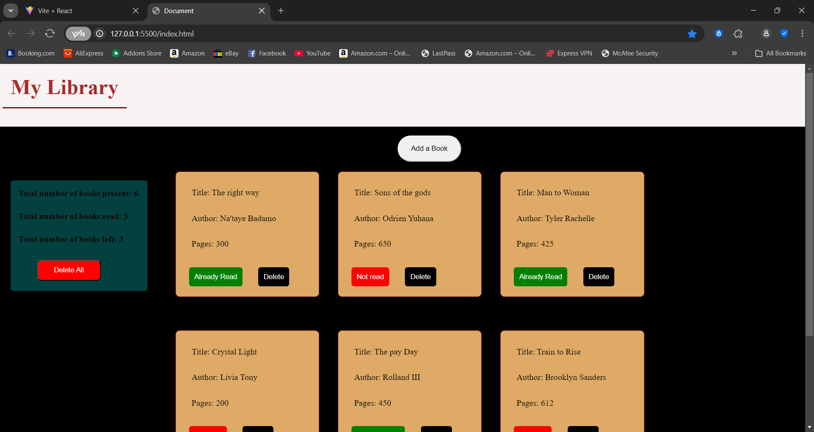
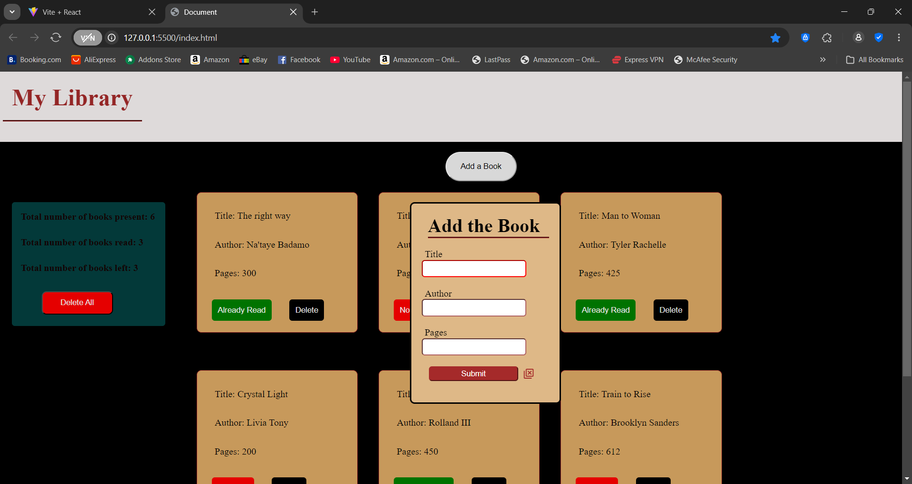
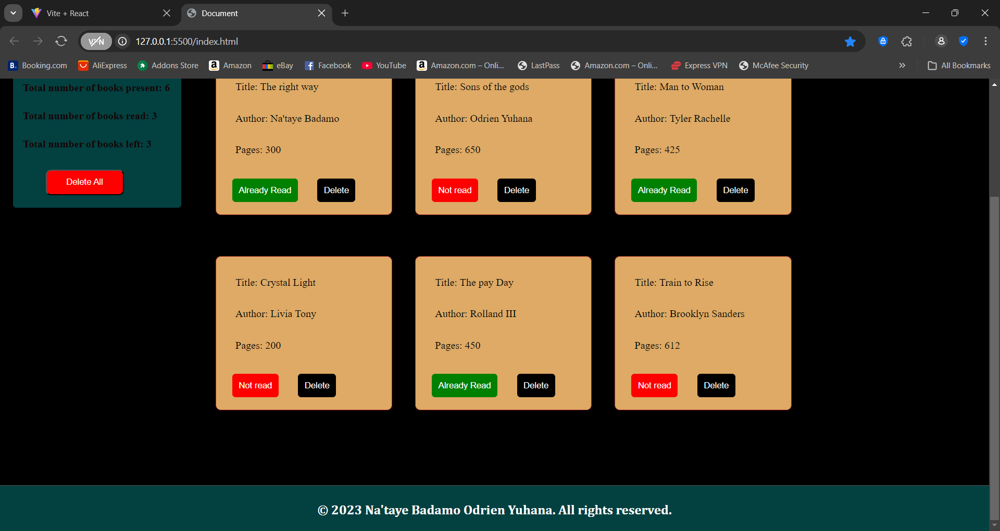

# library

# 📚 Small Library App

A simple and intuitive library management tool built with vanilla HTML, CSS, and JavaScript. This app allows users to add, manage, and track their books with ease.

---

## 📝 Description

The Library App is a lightweight, client-side application where users can:

- Add books with title, author, and status
- Mark books as read or unread
- Delete individual books
- View a dashboard with statistics:
  - Total books
  - Books read
  - Books left to read
- Clear all books at once with a single click

All interactions are instant and managed using the browser’s local state (no backend required).

---

## 📌 Features

- ➕ Add new books with full details
- ✅ Toggle read/unread status
- 🗑️ Delete individual books
- 📊 Real-time dashboard stats:
  - Total books
  - Books read
  - Books unread
- ⚠️ "Delete All" button for bulk removal

---

## 🛠 Tech Stack

- **HTML5**
- **CSS3**
- **Vanilla JavaScript**

---

